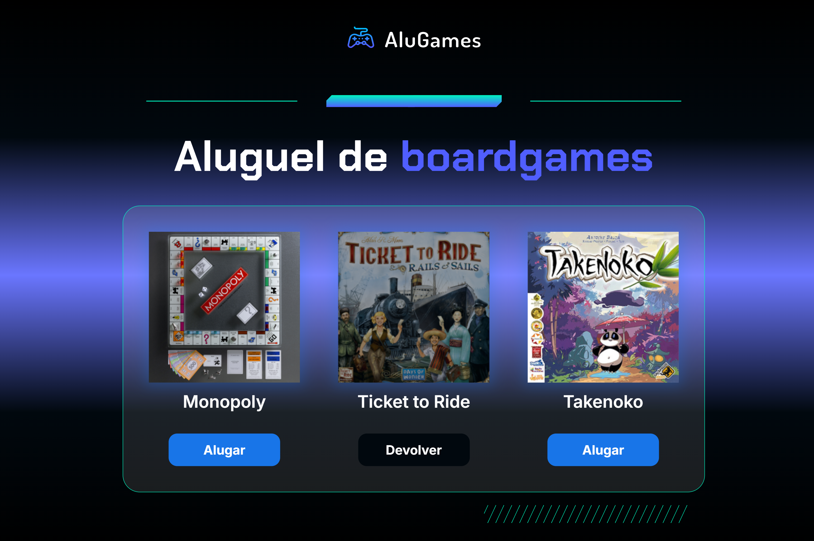

## Alura | AluGames
Essa é o resultado do projeto fictício pré-definido pela Alura, com o foco para prática de lógica e desenvolvimento utilizando JavaScript.

## Índice

- [Alura | AluGames](#alura--alugames)
- [Índice](#índice)
- [Visão Geral](#visão-geral)
  - [O desafio](#o-desafio)
  - [Captura de tela](#captura-de-tela)
- [Meu processo](#meu-processo)
  - [Construído com](#construído-com)
  - [O que aprendi](#o-que-aprendi)


## Visão Geral

### O desafio

Os usuários devem ser capazes de:

- Simular o Aluguel e a Devolução de jogos de tabuleiros através da página.
- Os botões alternam entre "Devolver" e "Alugar" ao serem clicados.

### Captura de tela


Neste exemplo o Jogo Ticket to Ride foi Alugado, portanto o jogo está indisponível para ser alugado, apenas após ele ser devolvido ficará disponível.

## Meu processo
Com a estrutura HTML da página já pronto. Foi preciso apenas identificar as classes dos elementos do DOM que seriam manipulados e, portanto utilizados no codigo com condicionais.

### Construído com

- JavaScript

### O que aprendi

Desenvolvi a habilidade de criar funções simples para manipulação do DOM, junto com condicionais

```javascript
function alterarStatus(id) {
    let game = document.getElementById(`game-${id}`);
    let imagem = game.querySelector('.dashboard__item__img');
    let botao = game.querySelector('.dashboard__item__button');
    console.log(game.textContent);
    if (imagem.classList.contains('dashboard__item__img--rented')) {
        imagem.classList.remove('dashboard__item__img--rented');
        botao.classList.remove('dashboard__item__button--return');
        botao.textContent = 'Alugar';
    }
    else {
        imagem.classList.add('dashboard__item__img--rented');
        botao.classList.add('dashboard__item__button--return');
        botao.textContent = 'Devolver';
    }
}
